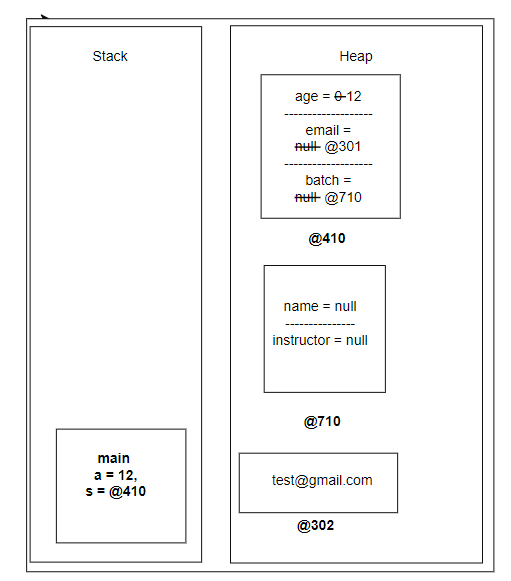
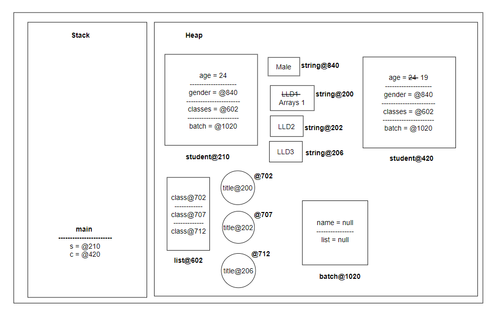
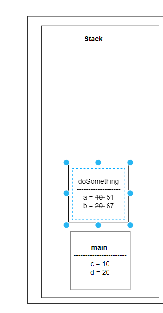
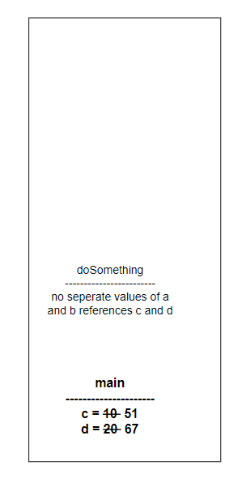
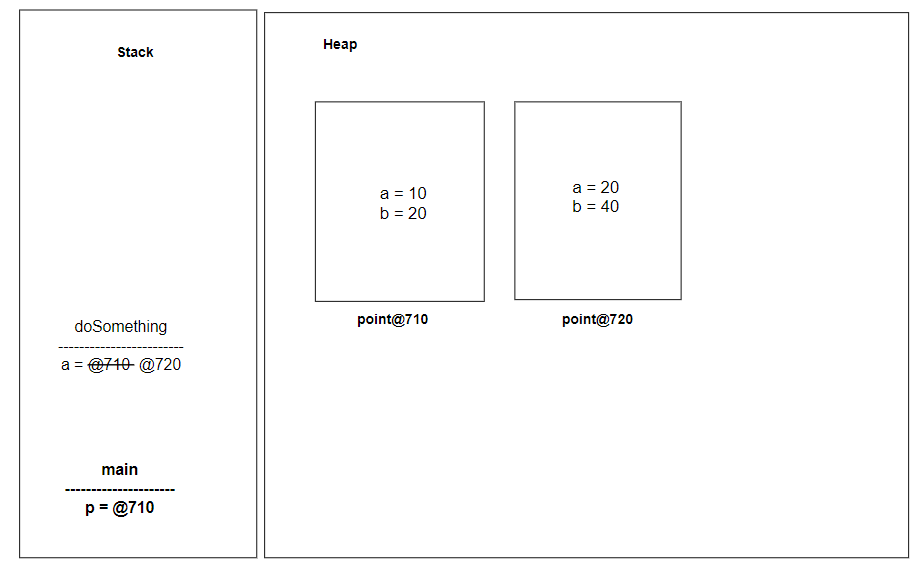

## Constructors and access modifiers

### Access modifiers
There are two types of modifiers in Java: access modifiers and non-access modifiers.

The access modifiers in Java specifies the accessibility or scope of fields, method, constructor or class.

There are four types of access modifiers in Java:
* **private** - can be accessed only within the class. Cannot be accessed from outside the class.
* **default** - Can be accessed only withing the package. cannot be accessed from outside the package. If we do not specify any access level, it will be default.
* **protected** - can be accessed within the package and outside the package through child class. If we do not make the child class, we cannot access from outside package.
* **public** - Can be accessed everywhere, from within the class, outside the class, within the package and outside the package.

| Modifier  | Class | Package | Subclass | Global |
|-----------|-------|---------|----------|--------|
| **private**   | Yes   | No      | No       | No     |
| **default**   | Yes   | Yes     | No       | No     |
| **protected** | Yes   | Yes     | Yes      | No     |
| **public**    | Yes   | Yes     | Yes      | Yes    |

### Constructor
>A constructor is a special type of subroutine called to create an object. It prepares the new object, often accepting arguments that the constructor uses to set the required member variables.

It is automatically called when object is created. These are the gatekeepers of the object-oriented design.

```java
public class Student {
    private String name;
    private String email;
    private Integer age;

    public static void main(String[] args) {
        Student student = new Student();
        student.name = "Vikas";
    }
}
```

### 1. Default constructor
A default constructor is a constructor created by compiler if we do not define any constructors for a class.

It can either have no parameters or if it has parameter all the parameters hae default values. If no user-deflined constructor exists for a class then compiler implicitly declares a default constructor parameterless constructor.

Also known as no-argument constructor or nullary constructor. All fields are left to their initial values.

```java
public class Student {
    private String name;
    private String email;
    private Integer age;
    
    public Student() {
        // no-arg constructor
    }

    public static void main(String[] args) {
        Student student = new Student();
        student.name = "Vikas";
    }
}
```

It is a method but has no return type because it implicitly returns the type of object that it creates.

**Syntax:**

<Constructor modifier> <Constructor Decalarator> <Constructor Body>

modifiers - public, private, protected or package 

Constructor can't be abstract, static, final, native or synchronized.

declarator is the name of the call followed by parameters list seperated by comma, enclosed in a parentheses.

### 2. Parameterised constructor

In default constructor, we can assign or inject state only after object creation. We can add sanitization logic in the getter and setters but won't be able to fail the instance creation.
Hence, we need to add parameterised constructor.

```java
public class Student {
    private String name;
    private String email;
    
    public Student(String name, String email) {
        this.name = name;
        this.email = email;
    }

    public static void main(String[] args) {
        Student student = new Student("Eklavya", "2k@drona.in");
        student.name = "Vikas";
    }
}
```
Constructor vs. Methods:
* Constructors never have an explicit return type.
* Constructors cannot be directly invoked (new keyword invokes them)
* Constructors should not have non-access modifiers.

> How a custom constructor works?
> 
> Before it even executes the very first line of itself, it initializes the object with teh default value of the data types of attributes.

### 3. Copy Constructor
Used when we want to create a copy of a given object with exact same values as the given object. The only way to create a new object will be via new keyword.

A custom constructor that creates a new object of the same class with exact same value of the attributes as another object passed to it.

#### How internally are object stored?
All the data/objects created in a program are stored in RAM.

The memory is divided in two parts - Stack and Heap
* Program starts with main - as soon as a function is called it is put in the stack, once a function execution is completed it is removed from the stack.
* When a method is executed and a variable is created, are stored where?
    > For primitive attributes (int, boolean, float, etc.), the variable/obj stores the value of the attribute directly.
    >
    >  For non-primitive attributes in the variable/obj, the address of the attribute is stored.

> All objects are stored in heap, all variables and primitive values are in stack.
>
> Stack - Function stack stores function calls and the variables inside the functions directly
> 
> Heap - Object heap stores all the objects and data related to them.

example 1:
```java
class Student {
    int age;
    String email;
    Batch batch;
}

class Batch {
    Instructor i;
}

class Instructor {
    String name;
}

class Test {
    public static void main(String[] args) {
        int a = 12; 
        Student s = new Student(); 
        s.age = 12; 
        s.batch = new Batch(); 
        s.email = "test@gmail.com";
    }
}
```

When main executes:


example 2:
```java
class Student {
    int age;
    String gender;
    List<Class> classes;
    Batch batch;
}

class Class {
    String title;
}

class Batch {
    String name;
    List<Student> students;
}

class Test {
    public static void main(String[] args) {
        Student s = new Student();
        Student c = new Student(s);
        c.age = 19;
        c.classes.get(0).title = "Arrays 1";
    }
}
```


> Shallow Copy
> 
> Copy of an object where some levels deep objects share the same memory location is called shallow copy.
> 
> If we modify objects in one object it reflects in other objects as well.
> 
> If the objects are immutable then are no harm in shallow copy.

> Deep Copy
> 
> Copy of an object where all level deep objects have different location is called shallow copy.
> 
> If all non-primitive data types in an object then we can create deep copy by calling copy constructors of each of the object.

### Pass by value and Pass by reference

```java
class Test {
    void doSomething(int a, int b) {
        a = 51;
        b= 67;
    }

  public static void main(String[] args) {
    int c = 10, d = 20;
    doSomething(c, d);
    print(c); //10
    print(d); //20
  }
}
```


```java
class Point {
    int a;
    int b;
    
    doSomething(Point a) {
        a.a = 51;
        a.b = 67;
    }

  public static void main(String[] args) {
    Point p = new Point();
    p.a = 10;
    p.b = 20;
    doSomething(p);
    print(p.a); //51
    print(p.b); //67
  }
}


```
Pass by value:
Java is always pass by value, the value of primitive variable is passed or address of non-primitive variable is assigned.

Pass by reference:
In C++ you can pass value sof the function as either value or reference.

```c++
// Pass by value
class Test {
    void doSomething(int a, int b) {
        a = 51;
        b= 67;
    }

  public static void main(String[] args) {
    int c = 10, d = 20;
    doSomething(c, d);
    print(c); //10
    print(d); //20
  }
}
```

```c++
//Pass by refernce
class Test {
    void doSomething(int &a, int& b) {
        a = 51;
        b= 67;
    }

  public static void main(String[] args) {
    int c = 10, d = 20;
    doSomething(c, d);
    print(c); //51
    print(d); //67
  }
}
```


```java
class Point {
    int a;
    int b;
    
    doSomething(Point a) {
        a = new Point(20, 40);
    }

  public static void main(String[] args) {
    Point p = new Point();
    p.a = 10;
    p.b = 20;
    doSomething(p);
    print(p.a); //10
    print(p.b); //20
  }
  
}
```


Final class in java: https://www.scaler.com/topics/final-class-in-java/

Volatile : https://www.geeksforgeeks.org/volatile-keyword-in-java/