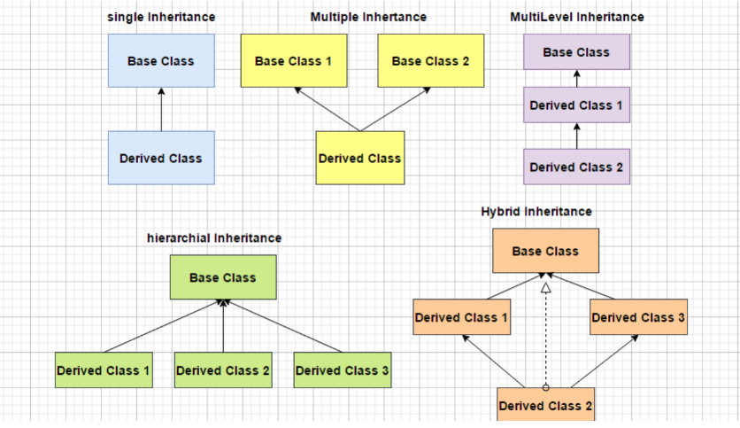
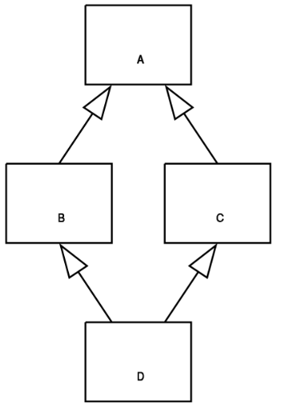

# Inheritance and Polymorphism

## Inheritance 
Inheritance is the mechanism that allows one class to acquire all the properties from another call by inheriting the class.
We call the inheriting class a child class and the inherited class as super class or parent class.


The new class is built upon the existing classes, we can reuse the methods and fields of the parent class. Moreover we van add new methods and fields in the child class.

Inheritance represents the IS-A relationship aka, parent-child relationship.

In order to inherit the methods and fields of the parent class, we need to use the keyword extends.
To pass the values to the parent class, we need to create a constructor and use the keyword super.
ex.
```java
public class User {
    private String name;
    private String email;
    
    public User(String name, String email) {
        this.name = name;
        this.email = email;
    }
}

public class Student extends User {
    private String batchName;
    private Integer psp;
    public Student(String name, String email, String batchName, Integer psp) {
        super(name, email);
        this.batchName = batchName;
        this.psp = psp;
    }
}
```

When we call the constructor of a class it automatically calls the veru first thing the default constructor of the parent ckass.
If parent class has no constructor without any params then throw error, in such case we use super(). 

Larger the idea, higher the level of abstraction.
## Types of inheritance
There are four types of inheritance:
1. Single - A single inheritance is when a class can have only one parent child;
2. Multilevel - A multilevel is when a class can have multiple parent classes at different levels.
3. Hierarchical - When two or more classes inherit a single class, it is known as hierarchical inheritance.
4. Multiple - When a class can have multiple parent classes. It is known as multiple inheritance.



## Diamond Problem
In multiple inheritance one class inherits the properties of multiple classes. Java does not support multiple inheritance (with classes).

The diamond problem or the deadly diamond probem is ambiguity that arises when two classes B and C inherit A, and class D inherits from both B and C. If there is a method in A that B and C have overriden, and D does not override it, then which version of the method does D inherit: that of B or that of C


## Generalization and Specialization
Converting a subclass into superclass type is called Generalization because subclass is becoming more general and it scope widens (up-casting).
It is safe because class will become more general.
We can access all the superclass methods but not the subclass methods.

Converting super class into subclass type is called specialization. Here the scope is narrowed or down casted. Narrowing is not safe because the classes will become more and more specific thus giving rise to more and more doubts.We need explicit casting.

```java
class Father { 
    public void work() 
    { 
        System.out.println("Earning Father"); 
    } 
} 
  
class Son extends Father { 
    public void play() 
    { 
        System.out.println("Enjoying son"); 
    } 
}

class Main {
    public static void main(String[] args)
    {
        // father is a superclass reference 
        Father father;

        // new operator returns a subclass reference 
        father = (Father) new Son();

        // which is widened using casting 
        // and stored in father variable 
        // Though casting is done but it is not needed 
        father.work(); // Earning Father

        // Uncomment next line to see the error 
        // father.play(); 
    }
} 
```

We override the superclass methods in subclass:
```java
class Father { 
    public void work() 
    { 
        System.out.println("Earning Father"); 
    } 
} 
  
class Son extends Father { 
    @Override
    public void work() 
    { 
        System.out.println("Earning Son"); 
    } 
} 
  
class Main { 
    public static void main(String[] args) 
    { 
  
        // father is the super class reference 
        Father father; 
  
        // new operator returns a subclass reference 
        father = (Father) new Son(); 
  
        // which is widened using casting 
        // and stored in father variable 
        // Though casting is done but it is not needed 
  
        // subclass method is invoked 
        father.work(); 
    } 
} 
```

```java
class Father { 
    public void work() 
    { 
        System.out.println("Earning Father"); 
    } 
} 
  
class Son extends Father { 
    public void play() 
    { 
        System.out.println("Enjoying son"); 
    } 
} 
  
class Main { 
    public static void main(String[] args) 
    { 
  
        try { 
            // son is a sub class reference 
            Son son; 
  
            // new operator returns a superclass reference 
            // which is narrowed using casting 
            // and stored in son variable 
  
            // This will throw exception 
            son = (Son) new Father(); 
  
            // Through a narrowed reference of the superclass 
            // we can neither access superclass method 
            // and nor the subclass methods 
  
            // Below lines will show 
            // an error when uncommented 
            // son.work(); 
            // son.play(); 
        } 
        catch (Exception e) { 
            System.out.println(e); //java.lang.ClassCastException: Father cannot be cast to Son
        } 
    } 
} 
```

```java
class Father { 
    public void work() 
    { 
        System.out.println("Earning Father"); 
    } 
} 
  
class Son extends Father { 
    public void play() 
    { 
        System.out.println("Enjoying son"); 
    } 
} 
  
class Main { 
    public static void main(String[] args) 
    { 
        // son is a subclass reference 
        Father father; 
  
        // new operator returns a subclass reference 
        // which is stored in the father variable 
        // father stores a Father class reference 
        // because of implicit casting 
        father = new Son(); 
  
        // father is narrowed 
        Son son = (Son)father; 
  
        son.work(); // works well 
        son.play(); // works well 
    } 
}
```
>Output:
> 
>Earning Father
> 
> Enjoying son


## Polymorphism
Poly means many and morphs means forms. Ability of a thing to be represented in many forms.

Polymorphism is often referred to as third pillar of the object oriented programming, after encapsulation and inheritance.
It has two distinct aspects:

* At runtime, objects of derived class may be treated as objects of base class in places such as method parameters and collections or arrays. When this polymorphism occurs, th eobjects's declared type is no longer identical to its run-time type.
* Base classes may define methods and derived classes can override them, they provide their own definition and implementation. At runtime when client code calls the method, the CLR looks up the runtime type of the object and invokes that override of the virtual method. In you source code you can call a method on base class, and cause a derived class's version of the method to be executed.

Polymorphism in Java is mainly divided into two types:
1. Compile-time polymorphism
2. Runtime polymorphism

Polymorphism in Java can be achieved in two ways:
1. Method Overloading - compile time
2. Method Overriding - runtime 

### Subtyping
Subtyping is a concept in object-oriented programming that allows a variable of a base class to reference a derived class object. This is called polymorphism, because the variable can take on many forms. The variable can be used to call methods that are defined in the base class, but the ctual implementation of the method is defined in the derived class.

```java
public class User {
    private String name;
    private String email;
}

public class Student extends User {
    private String batchName;
    private Integer psp;
}
```

he Student class inherits the name and email properties from the User class. The Student class also has its own properties batchName and psp. The Student class can be used in place of the User class, because the Student class is a subtype of the User class. The following is an example of how this works:

>User user = new Student();

### Method Overloading
Allows class to have more than one method having the same name, if theri argument lists are different.
It is similar to constructor overloading, as it allows a class to have more than constructor having different argument list.

The compiler distinguishes these two methods by the number of parameters in the list and their data types. The return type of method does not matter.

```java
public class User {
    private String name;
    private String email;
    
    public void printUser() {
        System.out.println("Name: " + name + ", Email: " + email);
    }

    public void printUser(String name, String email) {
        System.out.println("Name: " + name + ", Email: " + email);
    }
}
```

### Method Overriding
Runtime polymorphism is also called Dynamic method dispatch. Isntead of resolving the overridden method at complie-time, it is resolved at runtime.

The over overridden child class method is called through its parent's reference. Then th emethod is invoked according to the type of object in runtime, JVM figures out the object type and the method belonging to that object.

If a child class has a method same as its parent class, it is called method overriding.

If the derived class has a specific implementation of the method that has been declared in its parent class is known as method overriding.

Rules for overriding:
* There must be inheritance between classes.
* The method between the classes must be the same(name and number od arguments passed).

@Override annotation is optional, but good to practice. It ensures that method is actually being overridden. If the method i snot being overridden, the compiler will throw an error.
```java
public class User {
    private String name;
    private String email;
    
    public void printUser() {
        System.out.println("Name: " + name + ", Email: " + email);
    }
}

public class Student extends User {
    private String batchName;
    private Integer psp;
    
    @Override
    public void printUser() {
        System.out.println("Name: " + name + ", Email: " + email + ", batchName: " + batchName + ", psp: " + psp);
    }
}
```
**Advantage of polymorphism:**
* code reusability is the main advantage of polymorphism, once a class is defined, it can be used multiple times to create an object.
* compile-time polymorphism, similar functions have same name so becomes easier to understand.
* Same method vcan be created in the child class as in parent class in runtime polymorphism.
* Easy to debug as polymorphism adds necessary structure and regularity to computation.

**Disadvantage of polymorphism:**
* Implementing code is complex because understanding the hierarchy of classes and its overridden method is quite difficult.
* Problems during downcasting because implicit downcasting is not possible. Casting to child type or casting a common type to an individual type is known as downcasting.
* Broken code at time is subclasses use superclass in unexpected ways.
* Runtime polymorphism can lead to real-time performance issue, degrades the performance as decisions are taken at runtime.

Source:
https://d2beiqkhq929f0.cloudfront.net/public_assets/assets/000/056/022/original/Backend_LLD_1_Revision_content.pdf?1699269514

https://github.com/kanmaytacker/fundamentals/blob/sql-march-2023/oop/notes/03-inheritance-polymorphism.md

https://www.cs.cornell.edu/courses/JavaAndDS/abstractInterface/05diamond.pdf