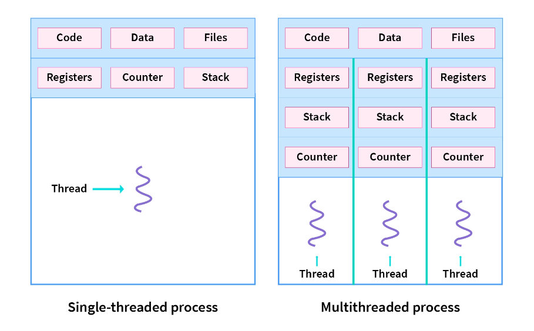
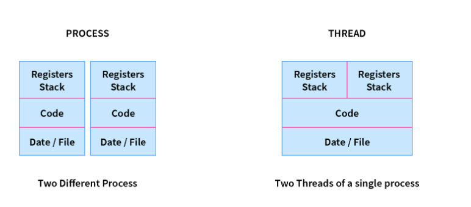

# Threads and Process Introduction

## What are threads?

Code when complied becomes Executable when downloaded to hard disk becomes program (application sitting on a disk, ready to be run).
This program when runs on a RAM becomes a process (program in execution).

An App like ms-word does more than one thing at a time:
* Display input on the screen
* spell check / Grammar check
* Saving in background
* Checking for updates

Till now the programs we wrote only have been doing one thing at a time. We need a way to allow program to do multiple things at same time.
Threads are a way to do it.

Threads are the smallest unit of execution.

> A thread is a lightweight process. It is a unit of execution within a process. A process can have multiple threads. Each thread has its oqn program counter, stack and registers. Threads share the same address space. This means that all threads in a process can access the same memory. This is different from processes where each process has its own address space.

Often, a process needs to perform multiple tasks at the same time. Creating new process is expensive as it requires a loy od resources.
Threads are used to solve this problem. Threads are used to perform multiple tasks within a process. This is done by sharing the same address space, meaning threds in a process can access the same memory.
This is different from processes where each process has its own address space.

Threads is a sequential flow of task within a process. Threads on SO can be same of different types. Threads are used to increase the performance of applications. Each thread has its own program counter, stack and set of registers. But threads of a single process might share the same code ans data/file. Threads are also called lightweight processes.



**Thread vs Process**

| Process                                                | Thread                                                                            |
|--------------------------------------------------------|-----------------------------------------------------------------------------------|
| Processes use more resources and hence are heavyweight | Are lightweight as they share resources with other threads in a process           |
| Creation and termination are slow                      | Creation and termination is faster compared to process                            |
| Have their own code, data/file                         | Share code, data/file within a process                                            |
| Communication is slower between processes              | Communication is faster between threads                                           |
| context switching is slower in process                 | Context switching is faster in threads                                            |
| Processes are independent of each other                | Threads are interdependent (they can read, write or change another thread's data) |
| ex. Opening two different browsers                     | ex. Opening two tabs in the same browser                                          |



**How to implement?**
* Think what all types of tasks do you want to do in parallel.
* Create class for each type of task

**Using threads in Java**

Create thread by extending Thread class or implement Runnable interface.
Thread class is subclass of object and implements Runnable interface. The Runnable interface has single method run(). This method is called when the thread is started.

```java

class NewThread implements Runnable {
    @Override
    public void run() {
        // Code to be executed by thread
    }
}
```

Create new thread by creating an object of NewThread class and passing it to the Thread class constructor. The Thread class constructor takes a Runnable object as an argument. This Runnable object is the thread that we want to create.

o run the thread, we call the start() method on the Thread object. This method calls the run() method of the Runnable object. The run() method is executed by the thread.

```java
NewThread newThread = new NewThread();
Thread thread - new Thread(newThread);
thread.start();
```
----------------
**Analogy: Toll booth vs. Computer**

Each car is basically a task that the toll booth has to fulfill.

In a computer a task is done by a processor/core. 

At one time a computer can execute number of core tasks.

Threads allow 1 process to do multiple things at the same time.

Booth - 
* Associated to a lane
* Within a lane cars are processed in order
* Across lanes cars are processed in parallel.

Both -> Core
Car -> Task
Lane -> Thread (Smallest unit if CPU execution)

1 core can execute only 1 thread at a time.

Each thread may get assigned multiple tasks. One thread can execute only 1 task at a time.

Every running program has at least one thread.

If program wants to do multiple things in parallel, it must code each of those things as part of different threads.
If 2 tasks are given to a thread they will execute sequentially.

* A Process when wants to execute things in parallel it creates multiple threads.
* Threads when created are passed to Operating system, which has CPU scheduler. Whenever a process, creates a new thread, the thread goes to a CPU scheduler.
* The CPU scheduler then schedules the threads to be executed by cores.

-------------
## Concurrency vs. Parallelism

Concurrency: A system that is able to handle multiple task, with each task at different stages of completion at the same time, but may or may not be making progress at the same time.

Parallelism: A system that is able to handle multiple tasks a time, which each task at different stages of completion also making progress at the same time.

If a system is parallel, it is concurrent.

If a system is concurrent, it not necessarily parallel.

A single core CPU cannot achieve parallelism. It can only achieve concurrency. A multi-core CPU can achieve both concurrency and parallelism.

--------------------------

## Context Switching - How to achieve concurrency?
At the same time, but not necessarily at the same instant. It is possible for multiple threads to be at different stages of execution at the same time but not being processed together. A single core CPU can only execute one thread at a time. But it can switch between threads very quickly. This is called context switching. This is how concurrency is achieved. A single core CPU can have concurrency but not parallelism.

Doing one task at a time can take long time, if task is huge and may cause starvation for other threads who want to execute other tasks. And hence giving fair chance to each thread is necessary to ensure none are starved and each get a chance to execute.

Doing tasks in 1 go would have taken lesser time, because no overhead of remembering where you has left earlier.

Time taken to save the state of the process to the RAM as well as to being it back to cache for processing is called context switching, it required to allow cores to execute multiple tasks at once.

IF CPU is switching between threads very fast it may actually waste time and not be doing anything productive.

-----------------------------

## What is Operating System?

Operating System allows us to interact with hardware of teh computer. However for develioer Operating system is:
1. Low level API - to interact with various components of the computer. A developer can use read and write system calls to read ans write to a while.
2. Resource Management - An operating system manages the resources of a computer, For instance, it manages the memory of a computer. Multiple processes can run on a computer at the sam etime, However, each process has its own memory space. The operating system manages the memory of a computer and allocates memory to each process. It also manges the CPU of a computer. It schedules the processes to run on the CPU.

-----------------------------

## Uniprogramming vs Multiprogramming

A uniprogramming operating system can only run one process at a time. A multiprogramming operating system can run multiple process at a same time.
Multiprogramming operating system can run multiple processes at a same time.

| Uni            | Multi                                         |
|----------------|-----------------------------------------------|
| simpler        | complex                                       |
| less efficient | more efficient - since runs multiple programs |
| CPU not utilizied efficiently | CPU is utilizied more efficiently|

Types of multiprogramming operating system:
* Number of users - A single-user OS can run one user at a time. A multi-user OS can run multiple users at a time.
* Scheduling of process - A preemptive OS can interrupt a process to run another process. A non-preemptive operating system cannot interrupt a process to run anpther process.
Preemptive operating system can only run multiple processes at atime and non-preemptive can run only one process at a time.

Resource:
https://github.com/kanmaytacker/fundamentals/blob/sql-march-2023/os/notes/threads-consolidated.md

https://levelup.gitconnected.com/how-web-browsers-use-processes-and-threads-9f8f8fa23371


