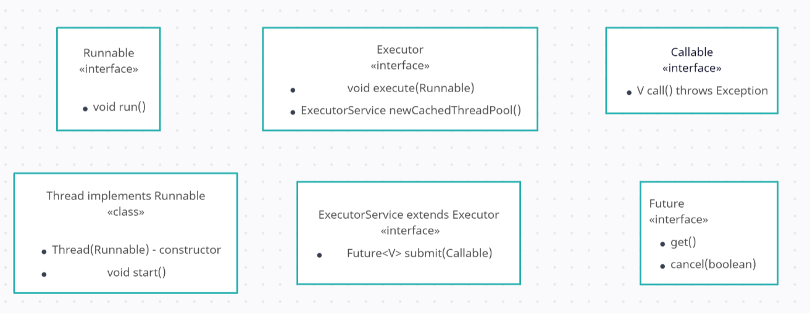

# Executor, Callable and Future

## Executor

The `Executor` interface is used to execute task. It is a generic interface that can be used to execute any kind of task. The Executor interface has only one method:

```java
public interface Executor {
    void execute(Runnable command);
}
```

The `execute` method takes a `Runnable` object as a parameter. The Runnable interface is a functional interface that has only one method. Executors internally uses thread pool to execute the task.
The execute method is `non-blocking`. It returns immediately after submitting the task to the thread pool. The execute method is used to execute tasks that do not return a result.

A `thread pool` is a collection threads that are used to execute tasks, Instead of creating a new thread for each task, a thread pool reuses the existing threads to execute the tasks.
This improves the performance of the application.

The `Executor` interface has a method called `newCachedThreadPool` that returns an `ExecutorService` object.
The ExecutorService interface extends the Executor interface. The ExecutorService interface has methods to execute tasks return a result. The ExecutorService interface also has methods to shut down the thread pool.

The `newCachedThreadPool` method creates a new thread for each task if there are no idle threads in the thread pool. If there is an idle thread in the thread pool, the newCachedThreadPool method reuses the idle thread to execute the task. The newCachedThreadPool method returns an ExecutorService object that uses a thread pool with a variable number of threads.

```java
Executor executorService = Executor.newcachedThreadPool();
executorService.execute(() -> System.out.println("Hello World"));
```

## Callable and Future

Runnables do not return result. If we want to execute a task that returns a result, we can use the `Callable` interface.
The callable interface is afunctional interface that has only one method.

```java
public interface Callable<V> {
    V call() throws Exception;
}
```

The call method returns a result of type V. The call method can throw an exception. The Callable interface is used to execute tasks that return a result. FOr instance we can use the Callable interface to execute a task that returns sum of two numbers;

```java
Callable<Integer> sumTask = () -> 2 + 3;
```

In order to execute a task that returns result we can use `submit` method of ExecutoerServoce inerface. The `submit` method takes a Callable as parameter and return `Future` object.
The `Future` interface has a method called `get` that returns te result of the task. the `get` method is a blocking method meaning it waits until the task is completed and then return the result of the task.

```java
ExecutorService executorService = Executors.newcachedThreadPool();
Future<Integer> future = executorService.submit(() -> 2 + 3);
Integer result = future.get();
```
Futures can be used to cancel tasks. Th eFuture interface has method `cancel` that can be used to cancel a task. `cancel` method takes boolean parameter. If true the task is cancelled even if it is running, if false the task is canceled only if the task is not running.

```java
ExecutorService executorService = Executors.newcachedThreadPool();
Future<Integer> future = executorService.submit(() -> 2 + 3);
future.cencel(false);
```


