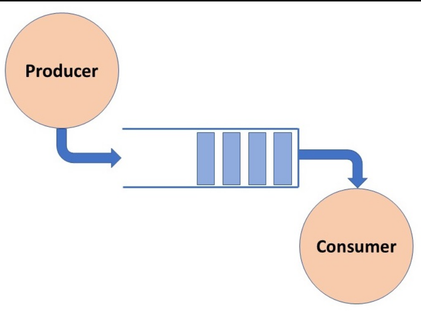

# Thread Synchronization

## Producer-Consumer problem

The Producer-Consumer problem is a classic synchronization problem in operating systems.

The problem is defined as follows: there is a fixed-size buffer and a Producer process, and a Consumer process.

The Producer process creates an item and adds it to the shared buffer. The Consumer process takes items out of the shared buffer and “consumes” them.



Possible problems:
* Whenever we have shared resource and more thane one thread trying to access it, we will surely have race condition.
* If we have multiple producers - there will be overflow in the buffer, no producer should add to buffer if the buffer is full. This is called overflow.
* If we have multiple consumers - they may try to consume the last resource in buffer at same time, but one will not find it. This is called underflow.

Certain conditions must be met by the Producer and the Consumer processes to have consistent data synchronisation:
* The Producer process must not produce an item if the shared buffer is full.
* The Consumer process must not consume an item if the shared buffer is empty.

**Producer**

The task of the producer is to create a unit of work and add it to the store. The consumer will pick that up when it is available. The producer cannot add exceed the number of max units of the store.
```java
public void run() {
        while (true) {
            if (store.size() < maxSizeOfStore) {
                store.add(new UnitOfWork());
            }
        }
    }
```

**Consumer**

The role of the consumer is to pick up unit of works from the queue or the store once they have been added by the consumer. The consumer can only pick up units if there are any available.

```java
public void run() {
        while (true) {
            if (store.size() > 0) {
                store.remove();
            }
        }
    }
```
The above code will lead to concurrency issues since multiple thread can access the store at one time. What happens if there is only one unit present, but two consumers try to acquire it at the same time. Since the size of the store will be 1, both of them will be allowed to execute, but one will error out.

## Base Solution - Mutex

